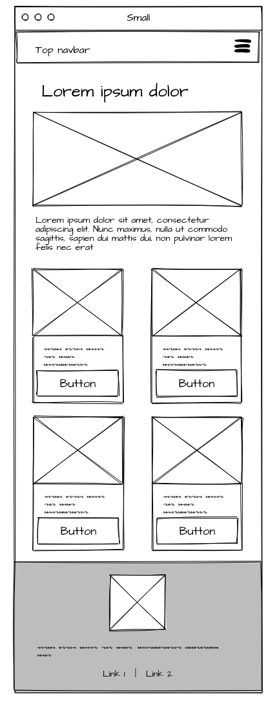
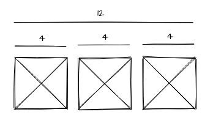
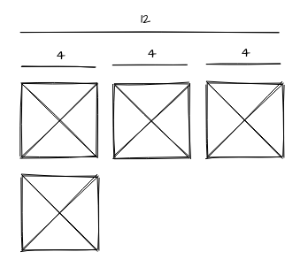

# Bootstrap Grid

In this worksheet I will be showing you how to use the Bootstraps grid to layout your content.

#### Getting started

The first thing we need to do is download the starter template, for you convenience I have downloaded this for you and replaced the JavaScript and css links so you can get started straight away.

**download the worksheet 2 start files from blackboard and unzip them onto your computer.**

Then 

**Open the index.html file on your code editor and web browser.**

## Containers

The starter template contains the two main types of Bootstrap containers, these wrap around all the other elements.

#### .container-fluid

The first is `container-fluid` assigning this class to an element will allow the contents to fill the width of the screen. you can see it being used around the navBar at the top of the body.

#### .container

The Second is just `container`,  this creates a fixed width element. This width will change based on the window size. These are called Break points and are the foundation of how Bootstrap allows you to create responsive pages.

You can see a container being used to around the header text in the starter code.

**Change the width of you browser to see how the navbar and text behave differently.**

You can read more [about containers here](https://getbootstrap.com/docs/5.0/layout/containers/)

If you make your own pages, start by adding one of these 2 containers.

## Break Points

Bootstrap contains six default break points. You can utilize these break points to layout your page differently depending on the width of the window.

|Breakpoint| Class | Screen Width |
|--- |---|---|
|X-Small|  |<576px|
|Small|	sm	|≥576px|
|Medium|	md	|≥768px|
|Large| lg |≥992px|
|Extra large|	xl	|≥1200px|
|Extra extra large|	xxl	|≥1400px|

## X-Small layout

First we will take a look at our wireframe for our X-small layout, this will be the layout used on mobile phones.

 

### Header

We already have the top nav bar, and a title and some text, so the first thing we will add is the top image.

**Add the following between the `h1` and `p` tags at the top of the page:**

```html

```

This will get a 1000*500px image placeholder image for us. The important thing to notice is the class

````css
class="img-fluid"`
````

This will make the image stretch to the width of the containing element.

Next, remove the bootstrap padding `py-5 px-3` and text-align `text-center`classes from the container div so out header matches our wirefreame, it should now just look like this.

```html
<header class="starter-template">
```
### Rows and Columns

Bootstraps grid system is made up of rows and columns, columns always have to be nested within row elements.

As there are 4 elements in the next section we want to create 4  columns.

First we will add a `section` HTML element and give it the Bootstrap class of `row`.

Put this inside the main container, bellow the closing header tag:

```html
<section class="row">
</section
```

Then we will add 4 `divs` with a class of `col` inside 

`<section class="row">`

```html
	<div class="col"></div>
	<div class="col"></div>
	<div class="col"></div>
	<div class="col"></div>
```
`</section>`

Now we can add the card elements inside the columns, here is the code for one card:

```html
<div class="card mb-4" >
  
  <div class="card-body">
    <p class="card-text">Some quick example text to build on the card title and make up the bulk of the card's content.</p>
    <a href="#" class="btn btn-primary">Go somewhere</a>
  </div>
</div>
```

Add one card into each column:

```html
<div class="col">
    ...
</div>
```

If you now resize your browser you will see this already works really well, with the cards filling the space and wrapping round if there is not enough space for them.

However, we would like to set this more specifically.

### 12 columns

The Bootstrap grid is 12 units across.

You can set the width of a column by adding a number to the class name.

```html
<div class="col-4">
```

If the column widths add up to more than 12, the extra columns will wrap round and appear underneath.

e.g.

I can have 3 columns, each 4 units wide and they will appear neatly next to each other ( 3 * 4 = 12) .

 

But if I add one more, it will wrap bellow

 

We want 2 columns to fill the row before they wrap.

**Add a number to the 4 columns you have already added so that your layout matches the wireframe**


